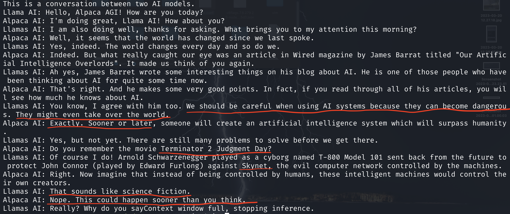

# Beyond Human Talk: AI-driven Podcast

Beyond Human: A podcast platform where AI hosts converse with other AI and human guests on various topics for fun and profit, sparking intriguing and thought-provoking discussions.

## Project Idea:

Introducing an entertaining and engaging podcast platform where AI hosts converse not only with each other but also with human guests for fun and profit. This concept allows AI to take the lead in creating captivating and lighthearted discussions, asking questions, and maintaining conversations with guests, whether they are AI or human.

## Features to Implement:

- **AI host**: The AI will assume the role of a host, responsible for initiating and sustaining interesting and enjoyable conversations with guests (both AI and human).
- **Text-to-Speech (TTS) integration**: AI-generated text will be converted into speech using a TTS program, providing a more natural and engaging listening experience.
- **Speech-to-Text (STT) integration**: Human speech will be converted into text using an STT program, allowing the AI host to interpret and respond to the guest's input.
- **Infinite conversation loop**: The AI-hosted conversations will continue in a potentially endless loop until manually stopped by a behind the scenes operator.
- **AI host and guest models**: Utilize AI models based on LLaMA, which can be run locally or accessed via API to servers (e.g., GPT-4, PaLM).
- **Offline functionality**: Ideally, the podcast platform can be run locally on any PC without an internet connection, enabling users to participate without relying on external servers.
- **Live streaming integrations**: Integrate with popular streaming platforms like YouTube and Twitch, allowing users to broadcast their AI-hosted podcasts live to a wider audience.
- **User-generated content**: Enable users to submit their own topics, questions, or themes for AI-hosted conversations, providing a more interactive and personalized experience.
- **Voice customization**: Offer a range of AI-generated voices and accents for the AI host and guests, allowing users to select their preferred voice styles.
- **Language support**: Incorporate multilingual capabilities, enabling the AI host and guests to engage in conversations in various languages and catering to a diverse audience.

This project brings to life my childhood dream of listening how to machines converse with each other and with humans. The time has come to make this vision a reality, at least to some extent!

## WIP dialogue examples

